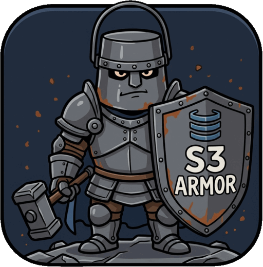

<div align="center">
  
</div>

<h1 align="center">s3armor</h1>

<p align="center">
  <a href="https://github.com/amsys/s3armor/actions/workflows/ci.yml"></a>
  <a href="https://sonarcloud.io/summary/new_code?id=amsys_s3armor"></a>
  <a href="LICENSE"></a>
  
</p>

s3armor is a small encryption proxy for S3-compatible storage. It encrypts
every object on your side, before the object leaves your network. The
storage operator gets ciphertext and nothing else.

## Why

S3 "server-side encryption" asks you to hand the key to the same server
that stores your data. With SSE-S3 and SSE-KMS the operator owns the key.
With SSE-C you send your own key along with every request and trust the
operator to forget it afterwards. In every variant, the party you want to
protect the data from is the party that can read it. That defeats the
point. It protects against a stolen disk and nothing more.

The fix is old and simple: encrypt before you upload. s3armor does this
for the S3 clients you already use, so none of them have to change.

## How it works

```
your app  --S3-->  s3armor  --S3-->  storage
(Nextcloud,        holds the key,    sees only
 restic, rclone,   encrypts and      ciphertext
 aws-cli, ...)     decrypts
```

- **Clients stay unmodified.** The proxy verifies and re-signs every
  request (SigV4). Nextcloud, Stalwart, restic, rclone, s3cmd and aws-cli
  all speak to it as if it were the bucket.
- **One key per object.** Each object gets its own key, wrapped by your
  master key. AES-256-GCM or XChaCha20-Poly1305, chosen for the CPU.
- **Large uploads stream.** Multipart uploads are encrypted part by part.
  Nothing is buffered whole.
- **Keys rotate.** Switch the active master key without re-encrypting
  what is already stored. A write-only node can encrypt but never decrypt.
- **One static binary.** TLS, metrics and rate limiting are built in. No
  database, no control plane.

## Quickstart

```sh
# Install: container image, .deb, .apk or static binary.
docker pull ghcr.io/amsys/s3armor:0.2.0
# Packages and binaries: https://github.com/amsys/s3armor/releases
# From source: cargo build --release

# 1. Generate a master key. Back it up now. It is the only way to read
#    your data, and there is no recovery if it is lost.
openssl rand -base64 32

# 2. Point at a backend.
export S3A_BACKEND_ENDPOINT=https://fsn1.your-objectstorage.com
export S3A_BACKEND_REGION=fsn1
export S3A_BACKEND_ACCESS_KEY=...
export S3A_BACKEND_SECRET_KEY=...
export S3A_KEY_ACTIVE=K1
export S3A_KEY_K1=<the base64 line openssl printed>

# 3. Give at least one client an inbound credential. With none
#    configured every request is rejected.
export S3A_CLIENT_APP_ACCESS_KEY=app
export S3A_CLIENT_APP_SECRET_KEY=some-secret-you-pick

# 4. Preflight the backend, then run.
s3armor check --bucket my-bucket
s3armor serve
```

Now point your S3 client at s3armor instead of the bucket. The
[user guide](docs/USER-GUIDE.md) covers `config.toml`, every `S3A_*`
variable, TLS, metrics and rate limiting.

## The master key is the data

Lose the key and every stored object is noise. The storage provider
cannot help. Put the key in a password manager before you store the
first object.

## Documentation

- [`docs/ARCHITECTURE.md`](docs/ARCHITECTURE.md): design, threat model,
  and what the proxy does not protect against.
- [`docs/USER-GUIDE.md`](docs/USER-GUIDE.md): install, configure, operate.
- [`docs/DEVELOPER-GUIDE.md`](docs/DEVELOPER-GUIDE.md): build, test,
  contribute. Run `pre-commit install --install-hooks` once per clone.

## License

AGPL-3.0-or-later. See [`LICENSE`](LICENSE).
